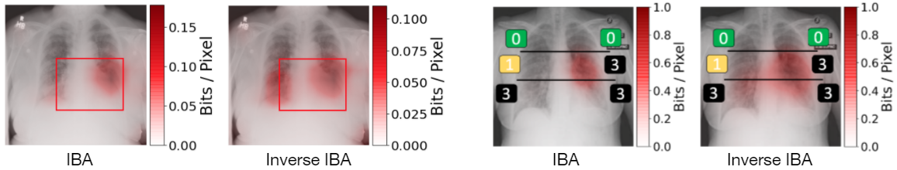
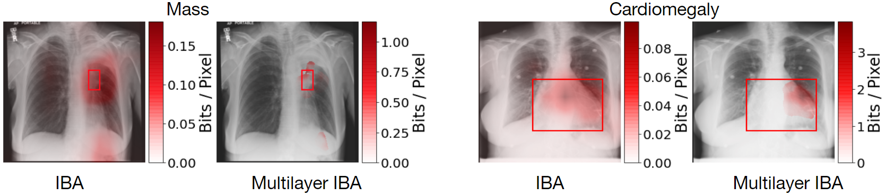
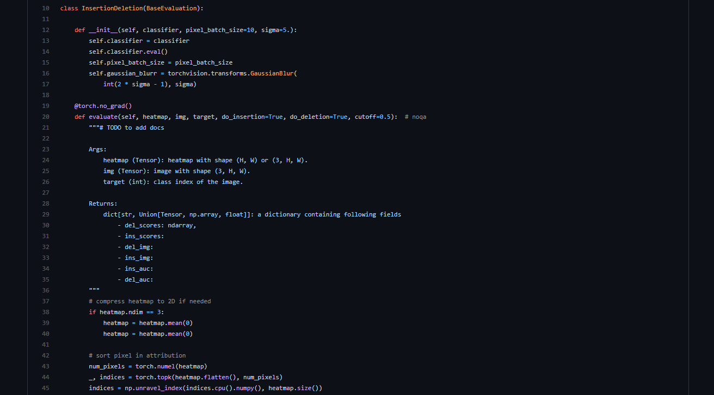

#### In a nutshell
We propose several explanation methodologies building on Information Bottleneck Attribution (IBA):

* Our main contribution is the Inverse IBA saliency (attribution) method which identifies *any* region that has predictive information for the model.

* We also propose Regression IBA for explaining regression models. Using Regression IBA we observe that a model trained on cumulative COVID-19 severity score labels implicitly learns the severity of different X-ray regions.
* Finally, we propose Multi-layer IBA to generate higher resolution and detailed attribution/saliency maps.


#### Resources
View the paper on **[arXiv](https://arxiv.org/abs/2104.00411)**
(The camera-ready version will appear in the proceedings of MICCAI 2021.)

Check the [Code on GitHub](https://github.com/CAMP-eXplain-AI/CheXplain-IBA)
[](https://github.com/CAMP-eXplain-AI/CheXplain-IBA)

#### Citation
Please cite the work using the below BibTeX (also available on the Open Access link above)
``` bash
@misc{khakzar2021explaining,
      title={Explaining COVID-19 and Thoracic Pathology Model Predictions by Identifying Informative Input Features}, 
      author={Ashkan Khakzar and Yang Zhang and Wejdene Mansour and Yuezhi Cai and Yawei Li and Yucheng Zhang and Seong Tae Kim and Nassir Navab},
      year={2021},
      eprint={2104.00411},
      archivePrefix={arXiv},
      primaryClass={eess.IV}
}
```

#### Contact
For inquiries and feedback please contact Ashkan Khakzar (ashkan.khakzar@tum.de). We would be happy to help and we appreciate your feedback.
